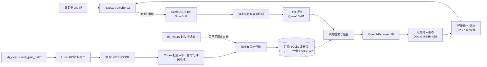

# 商学院本科生 QQ 群答疑智能体架构设计

版本：0.1（本地实现稿）  
日期：2026-08-06

## 1. 设计目标

系统面向商学院本科生 QQ 群，自动识别校园事务问题，并以可追溯的官方证据回答。它不是通用聊天机器人，也不是实时网页搜索机器人。

核心目标：

- 仅响应配置白名单内的群消息，永不处理私聊。
- 普通问句先判断校园范围；`#` 只强制进入答疑流程，不绕过范围、证据和安全门槛。
- 回答目标为80至240字，正文默认上限300字，最多展示3个官方来源；低置信度草案也直接发送，标记只用于事后排查。
- 任一关键检索组件故障时停止回答，不退化为纯关键词结果，也不允许大模型用自身知识补答。
- 运行时不抓网页、不读远程文章、不修改知识库。
- 与现有 NapCat 和 Minecraft Bridge 共存，不替换原有事件上报客户端。

## 2. 总体架构

在线运行链与离线资料生产链完全分开。Luna 没有线上发布权；线上 Bot 也没有抓取或写库能力。

## 3. 在线请求流程

1. OneBot 事件进入 `/onebot/v11/http`。
2. 私聊、非白名单群、机器人自身消息直接忽略。
3. `#` 开头的非空消息进入强制答疑；普通消息先过滤纯数字、常见附和寒暄和机械重复，再仅将具备问句特征的内容送入校园范围规划，群聊噪声不调用模型。
4. 按消息 ID 去重10分钟；按“群号+用户”执行3秒冷却。
5. 全局最多并发处理2条，等待队列最多50条；队列满时明确提示繁忙。
6. 读取同一“群号+用户”最近3轮上下文，超过30分钟自动失效。
7. 查询规划器输出独立问题、最多3个子查询、实体、所需事实面和过滤条件；`out_of_scope` 直接归为证据不足。
   - 受众由程序强制固定为“本科生”，不信任模型自由生成的受众值；
   - 校区只接受凌水、开发区、盘锦及其“校区”别名，“全校”规范化为无指定校区；
   - 指定校区检索仍保留空校区和“全校”卡，避免漏掉全局政策。
8. 四路检索全部成功后才继续：
   - 标题、标准问题、别名和生成问题的精确匹配；
   - 多字段加权 BM25；
   - 中文字符三元组相似召回；
   - `bge-m3` 1024维向量在 `sqlite-vec` 中做精确近邻搜索。
9. 用 RRF 融合四路排序并保留Top50；装载完整Top50后，由固定预算分配器选出最多12张交给 Reranker。分配器先覆盖独立 `(subject_key, fact_key)`，同一来源的同一事实确定性去重，同一事实最多保留2个不同来源供语义精排，标题相同但事实键不同的卡互不误杀，并预留最多1张无证据导航卡。这样不会因前段重复卡过密而丢掉第25名以后的独立事实，也不扩大远端精排调用量。
10. Reranker 分数低于0.35的卡不进入回答；事实卡按来源分组，只从能够独立覆盖必需事实面的同一来源选择最多4张子事实卡，并补齐同源父章节上下文。父卡不仅必须同源，其时效必须一致、校区范围必须覆盖子卡、受众不能比子卡更窄；构库先拒绝不兼容关系，运行时再按当前 QueryPlan 复验父卡，防旧库或手工改库绕过。任何跨来源或越出查询证据作用域的父子关系都 fail-closed。
11. 若只命中已去事实化、没有原文证据的导航卡，程序不调用回答模型，不陈述具体事实，只提示已定位官方页面并附程序持有的1个官方来源。
12. 其余情况由回答模型生成“证据辅助草案”：允许忠实改写、压缩和跨卡组织，不要求逐字引用；模型可返回 `confidence`、`needs_review` 和可选 `claims`，这些字段只用于事后质量记录，草案仍直接发送。
13. 程序只做轻量确定性校验：答案非空、默认不超过300字、不含模型生成 URL，`claims.card_ids` 若存在必须来自本轮检索卡；缺少 claim 或低词汇重合只标记 `quality_notes`，不阻断回答。字符串包含不能可靠判断语义忠实度，因此不再作为生产门禁。
14. 程序从模型提示的卡片中附加最多3个真实官方 URL；允许多个来源并列展示，真人可据此回看原文修订草案。
15. 无上下文的重复问题使用5分钟有界答案缓存；相同问题并发时共享一个在途请求。有上下文追问和任何失败结果不缓存。

RRF 使用固定公式：

`score(d) = Σ 1 / (60 + rank_channel(d))`

这里不使用 OpenSearch、Qdrant 或 Dify 运行时。知识规模只有数千篇，SQLite 精确向量搜索在当前规模下更容易验证、占用更低，也避免在22GiB且已有约14GiB常驻内存的 VPS 上增加新服务。

`sqlite-vec` 表同时保存时效、校区和人群 metadata，过滤在KNN选择Top-K之前完成，避免“先取全库Top50、后过滤”导致符合条件的卡被截断。多校区政策按规范集合编码，例如 `凌水|开发区`；查询只匹配包含目标校区的集合，不会误覆盖盘锦。当前为三个词法通道配置专用只读连接，向量使用主连接，四路并行且单连接串行保护；3652张、1024维的Windows复测中，四路召回P95为29.9ms，包含Top50装载和候选分配的完整本地检索前端P95为31.7ms，候选装载与分配本身P95为2.3ms；2并发200次压力检查无结果不一致。ARM64、1.5核容器尚未实测，不能把本地数字视为VPS承诺值；详细数据见 `docs/retrieval-performance.md`。

## 4. 失败语义

系统严格区分两类失败：

| 类型 | 触发条件 | 群内提示 |
|---|---|---|
| 证据不足 | 校园范围外、无候选、Reranker 低分、必要事实面缺失 | `知识库暂未收录足够依据。` |
| 系统异常 | SQLite、FTS、向量、Embedding、Reranker、回答模型或发布版异常 | `检索服务暂时异常，请稍后再试。错误编号：XXXXXXXX` |

关键组件异常时禁止返回 BM25 等弱结果。模型或知识库启动失败也不会让 NoneBot 进程退出；白名单群的有效问题会收到固定 `STARTUP` 错误，便于定位。

## 5. 知识卡与文章目录

### 5.1 知识卡

知识卡是运行时回答事实的唯一依据，至少保留：

- `evidence_quote`：官方原文中的连续证据片段；
- `source_locator`：证据在网页、通知或附件中的位置；
- `generated_questions`：可命中的自然问法；
- `aliases`：简称、旧称和常见说法；
- `risk_level`：低、中、高风险；
- `extraction_confidence`：离线抽取置信度；
- `facts`、`facets`、`validity`、`source_authority`；
- `parent_card_id`：子事实卡到父章节的关系。

标题允许 Luna 做语义归纳，不要求逐字出现在文章里；事实证据仍必须逐字可追溯。证据不完整的卡优先修写，无法修写时降为导航卡，不因为标题改写而直接误杀。导航卡在审核时强制清空 `facts`、`facets` 和不可逐字核验的引用；构库阶段会再次拒绝未净化导航卡或非官方来源。

完整 `clean_text` 只存在于离线 Luna/审核语料。构库时先用全文验证 `evidence_quote` 的逐字归属，再只把审核后的证据片段、来源元数据和全文哈希写入线上 SQLite；运行库不保留整篇文章，避免体积膨胀，也避免降级卡已清除的信息残留在生产正文列中。Embedding 与 Reranker 的语义文本包含逐字证据，不使用模型生成的 summary/facts 证明相关性；必需事实面也只能由逐字证据覆盖。

### 5.2 “类似 Skill”的文章目录

用户提出的“固定文章链接和大意，需要时直接调用”的思路适合离线资料生产，但不能替代事实知识卡。设计为 `Source Catalog`：

- 固定保存官方 URL、标题、发布日期、短摘要、主题标签、抓取状态和内容哈希；
- 站群索引可直接生成 `catalog_only` 导航卡：只含经程序校验的官方标题和 URL，不伪造正文或大意；外部域、微信平台域和重复 URL 默认排除；
- Luna 先查目录决定哪些文章值得抓取、刷新或补充搜索，避免每次从头阅读全部文章；
- 同一 source_id 只允许 `catalog_only → success` 单向升级且 URL 必须稳定；升级成功后替换旧导航卡。两个不同正文修订、URL 漂移或逆向覆盖会停止合并，交给 Codex 裁决；
- 只有需要生成或更新事实卡时才读取文章正文；
- 当前已从3336条站群索引生成2898张目录导航卡；显式研究生、教师、人事等424条标题被排除，外部/平台域与重复 URL 继续过滤。旧年份默认仅供历史意图检索，Luna 按正式评测缺口和问题热度逐步将目录卡升级为事实卡，无需先抓完全部文章；
- 线上 Bot 不调用目录去读网页，只读取已经审核发布的卡；
- 线上仅命中目录型导航卡时，返回程序生成的无事实导航提示和官方链接，不让模型根据大意补写答案；
- 仅有描述无 URL 的 `kb_clean` 项，由 Luna 搜索官方来源并回填候选来源；仅有 URL 的项目由 Luna 抓取、清洗和抽卡；URL+描述的项目执行核验与刷新。
- 已知 URL 返回404、403、验证码或栏目权限时记录 `fetch_failed`；全量收集后由程序转换为保持同一 source_id 的 `official_search_and_verify` 救援任务，旧 URL 只能作为定位提示，不能成为事实证据。

因此该目录相当于 Luna 的离线“资料导航 Skill”，而不是线上回答的证据替身。

## 6. Luna 与 Codex 的职责边界

| 环节 | Luna | Codex |
|---|---|---|
| 官方网页抓取与补充搜索 | 执行 | 制定范围与抽查 |
| 网页清洗、正文识别、去重 | 执行 | 定义规则与修正异常 |
| 候选知识卡、问题变体 | 生成 | 批量审核与修写 |
| 冲突与时效判断 | 提示候选冲突 | 最终裁决 |
| Embedding 构建 | 可作为离线批处理执行器 | 校验维度与完整性 |
| 发布线上知识库 | 无权限 | 评测通过后原子发布 |

`kb_faculty.csv` 是85条越权测试材料，只能进入隔离审计和负样本评测，永远不得进入生产检索、Embedding 或知识卡。

## 7. 模型分工

| 角色 | 默认模型 | 作用 |
|---|---|---|
| 查询规划 | Qwen3.5-9B | 范围判断、问题改写、子查询和过滤条件 |
| Embedding | bge-m3 | 1024维查询与知识卡向量 |
| Reranker | Qwen3-Reranker-8B | 对融合后的候选做语义精排和证据门槛判断 |
| 回答 | Qwen3.5-35B-A3B | 基于最多12张候选事实卡生成证据辅助草案，允许忠实改写并返回置信度/待复核标记 |
| 有限重试候选 | 122B | 仅在结构化输出错误等可恢复场景使用，当前版本尚未接入 |

以上四个运行时角色统一经 `http://aigw.dlut.edu.cn/v1` 调用；已实测 `bge-m3` 的 `/embeddings`、`Qwen3-Reranker-8B` 的 `/rerank` 和两个 Chat 端点均返回有效响应。网关 API key 只存在于运行时环境，不进入代码、发布证明或交接包。模型页面只展示 Chat 端点时，仍以实际契约探测结果为准。

122B 不作为日常兜底，也不能在证据不足时补答；后续如接入，最多重试1次，并继续通过相同证据校验。

## 8. 发布与回滚

每个发布版包含：

- `knowledge.sqlite`；
- `manifest.json`；
- `build_report.json`；
- `review_report.json`；
- 评测通过后生成的 `evaluation_report.json`。

发布流程为“候选卡 → Codex 审核 → 构库 → 完整性检查 → 固定评测 → 原子切换 `current.json`”。构库、评测和运行时的非密钥模型配置必须完全一致，固定阈值和每项评测检查由发布管理器依据原始指标重新计算，不能只信任报告中的 `passed`。运行时以只读、immutable 模式打开 SQLite，并核对数据库哈希与向量维度。旧版本保留，可通过切换指针回滚；运行时没有写库权限。

固定评测至少300题，强制最低配额为正常题120、历史题20、无答案题40、校园范围外题30、faculty越权题30；归一化后的重复问题不能靠更换ID重复计数。正例必须同时提供预期卡和官方URL，历史对话最多3个完整轮次。Embedding 或 Reranker 在评测过程中故障时，整次评测失败，不能把系统故障计作“正确拒答”。每题都会写入不含问题正文的评测账本：只记录ID、类型、answered/insufficient/error结果、Recall@50/5命中、最终引用卡、官方来源、延迟和失败理由；账本带独立SHA-256。

评测不仅检查 Recall@50/5，还要求最终回答实际引用预期卡，并由评测器独立重查最终句子、引用卡贡献和唯一来源 URL；无答案、范围外和faculty三类克制率分别计分，faculty必须100%拒答，不能被其他负例的高分掩盖。发布管理器不信任报告里的汇总字段：它先校验评测账本摘要，再从全部逐题行重算题型计数、指标分母、Recall、最终引用命中、官方来源率、三类克制率和延迟，任何汇总与账本不一致都拒绝发布。发布证明还强制绑定 reviewed JSONL、知识库、评测集、faculty 集、模型名、Embedding维度、Reranker阈值、超时、端点指纹、响应上限、Embedding批大小、语义文本上限、提示词哈希、协议版本及整个运行时代码包哈希。reviewed JSONL、审核报告、评测集和 faculty CSV 都先读取为不可变字节快照；解析对象与 SHA-256 必须来自同一份字节，长任务结束还会拒绝期间已变化的原路径，避免“实际处理A、报告绑定B”。正式评测必须绑定交接包中固定85条 faculty 隔离材料的已批准 SHA-256，同时校验固定表头、必填 query、重复行和长描述片段泄漏；替换文件、85个空/重复行都不能获得发布资格。运行时配置与评测报告任一不一致即拒绝启动，API key不写入产物。

staging 只有在清单版本、审核门、数据库哈希、行数、schema、Embedding维度和报告绑定全部通过本地校验后，才原子进入正式 `versions/<version>`；失败不会占用版本号。运行时关闭时先拒绝新回答、取消并等待所有真实执行（包括带上下文追问和禁用缓存的任务），再关闭 SQLite 与模型连接，避免停机竞态。

## 9. VPS 部署与现有服务共存

已核对目标 VPS：Oracle Linux Server 9.7、aarch64、4核、22GiB 内存；主机当前约使用15GiB、可用约7.3GiB，根盘98G/已用60G。现有容器包括 `qq-mc-bridge`、`qq-mc-napcat`、`<other-service>`、`<other-service>`、`<other-service>` 和 `<other-service>`。Bot 设计为：

- 常驻目标350至700MiB；
- 内存硬限制1GiB；
- CPU上限1.5核；
- `memswap_limit` 与内存上限相同，不额外使用 Swap；
- `oom_score_adj=500`，极端内存压力时优先终止 Bot；
- 并发2、队列50，避免请求堆积放大内存。
- 模型网关单响应体上限2MiB；会话历史除每人最多3轮、30分钟失效外，全局最多保留2048个活跃会话键。

Compose 只加入现有外部网络 `qq-mc-bridge_default`，不创建或替换任何现有服务。NapCat 保留当前上报：

`http://bridge:8088/onebot`

并新增一个 HTTP Client：

`http://campus-qa-bot:8080/onebot/v11/http`

NoneBot 调用 NapCat API 使用：

`http://napcat:3000`

首次新增 NapCat HTTP Client 可能需要重启 NapCat，QQ 链路会短暂中断；该操作交给 VPS agent，在本地构库、评测和容器验证完成后单独执行，不能与现有 Bridge 替换或合并。OneBot HTTP Client 必须配置与 `ONEBOT_V11_ACCESS_TOKEN` 相同的随机 token；Bot 启动时没有有效 token 会拒绝接收事件。VPS agent 的职责仅限 QQ/NapCat 登录、HTTP Client 配置和链路冒烟，不得改动 Bridge、知识库、模型配置或审核资产。

## 10. 当前实现状态

### 10.1 口径修订（2026-08-07）

本版本不把“逐字引用证据”当作生产要求。回答模型可以忠实改写，程序只保证来源卡和链接不被伪造，并记录 `needs_review`、`confidence`、`quality_notes`；低置信度草案不等待审批，直接发送，群内指出问题后再修正。评测中的召回、改写质量和低置信度均为事后质量信号；只有 faculty 泄漏和模型生成链接等硬安全问题阻断发布。`LUNA_ANSWER_MODE=strict` 仅保留给回归审计，生产默认 `draft`。

已完成本地实现与154项测试：消息白名单策略、`#` 强制入口、普通问句筛选、上下文、去重、冷却、固定上限的消息去重表、执行级并发与队列、single-flight与完整停机等待、模型响应/会话内存上限、四路并行检索、多校区预过滤、RRF、固定12张多样性候选分配（候选饱和时保留跨来源复核位）、仅看标题和逐字证据的 Reranker 门槛、父卡证据作用域双重校验、原文约束的必需事实面、抽取式逐字证据门、安全导航回答、单来源、镜像源审计去重、目录到正文单向升级、失败 URL 官方搜索救援、严格 Luna 数组/哈希/未知字段契约、32卡有界 Embedding 构库、分类评测门与独立答案复验、逐题评测账本及指标重算（含金标准 ID 反算与输入摘要绑定）、不可变输入快照、构库—评测—运行时模型及代码绑定、固定阈值复算、完整SQLite staging校验、无全文只读构库、schema兼容检查、固定85条faculty隔离集证明、四模型启动就绪探测、OneBot token 启动门、启动失败保活、Docker/Compose 草案。安全审计未发现已提交的私钥、`.env` 或 API key；审计清单和残余风险见 `docs/security-audit.md`。

Luna 最终审核已闭合：3227 张卡（approved 3024、downgraded 190、rejected 13、pending 0、conflict 0），167 个 v8 来源、49 个 v6 rescue 来源和固定 Source Catalog 已合并，最终审核 JSONL 为 `work/luna_final_reviewed_20260806.jsonl`，SHA-256 为 `7bead5d33b2b3022f2da59088bb12cbba842985c56c6a1dbb80ef739f6e64f20`。`kb_faculty.csv` 仍只作隔离审计和负样本评测，未进入候选卡、Embedding 或生产检索。

尚未发布的部分是有意保留的门槛：大工网关四模型契约已经实测通过，300题评测集已由用户确认并逐字节冻结，但正式 `knowledge.sqlite` 仍须完成构库、固定评测和 ARM64 容器复测后才能原子激活。交接包已准备好，VPS agent 只负责注入运行时密钥、登录 QQ、配置 NapCat HTTP Client 和做链路冒烟；其余资料生产、审核、构库、评测、发布和回滚流程均由本项目脚本与文档定义。GitHub 平台选型证据见 `docs/github-project-review.md`。
